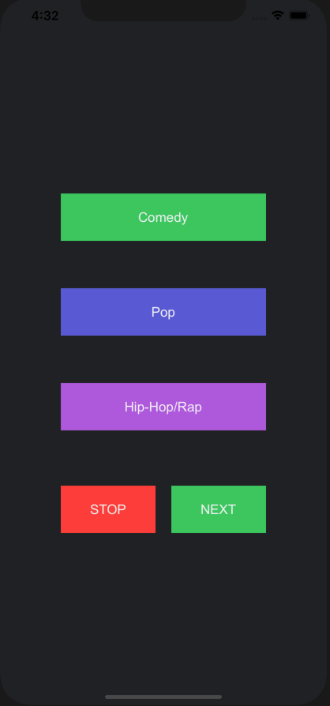

# Music Genre Selector App

This is my first succcessful, basic Swift iOS App. 

This application is a music genre selector app that has 3 buttons: Comedy, Pop, Hip-Hop/Rap that are able to 
play music in that genre that are stored in user's iPhone music library.

## What did I learn
Basic UI in xCode, Creating buttons, xCode github/Version Control, privacy permission (accessing iPhone music
library), button functionality, adding constraints to buttons to be able to resize with different screen sizes. 

## What does it look like? 

